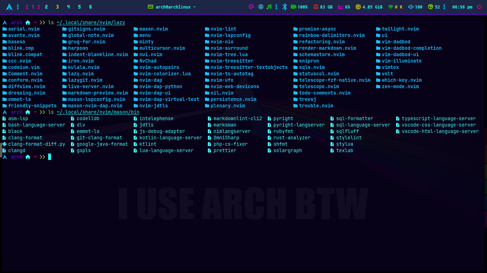
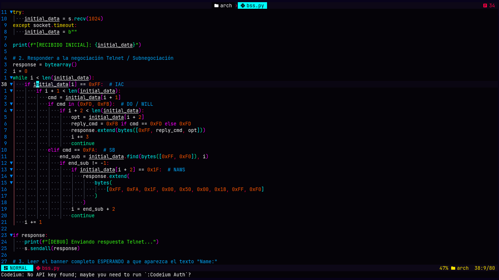
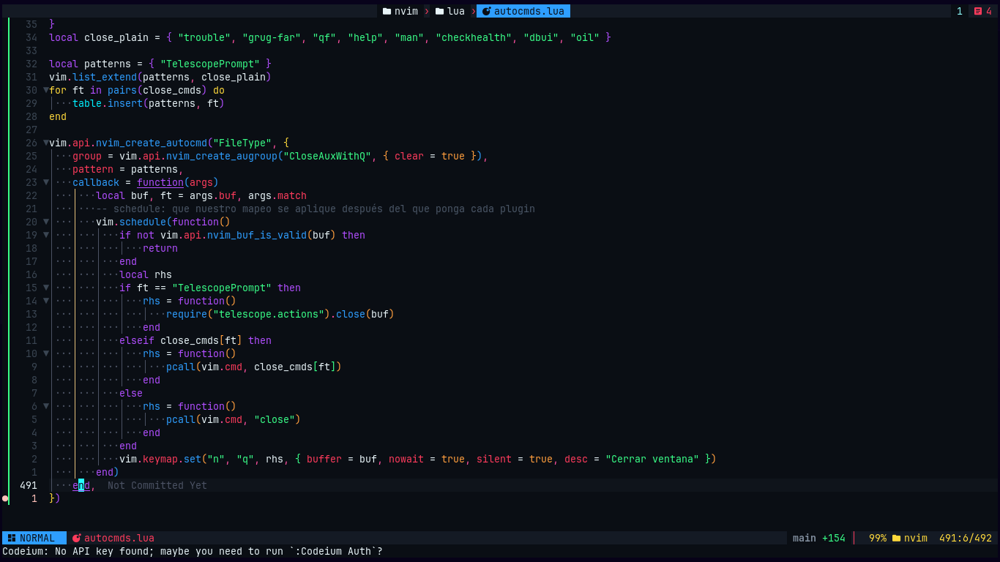
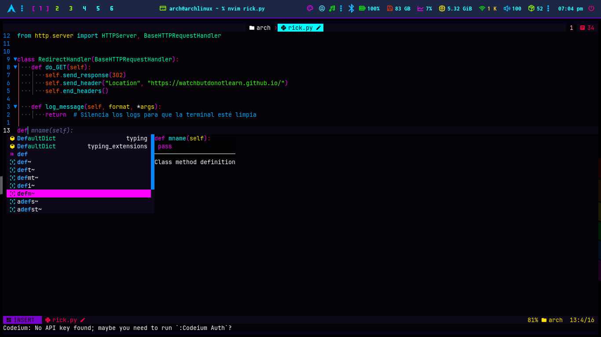
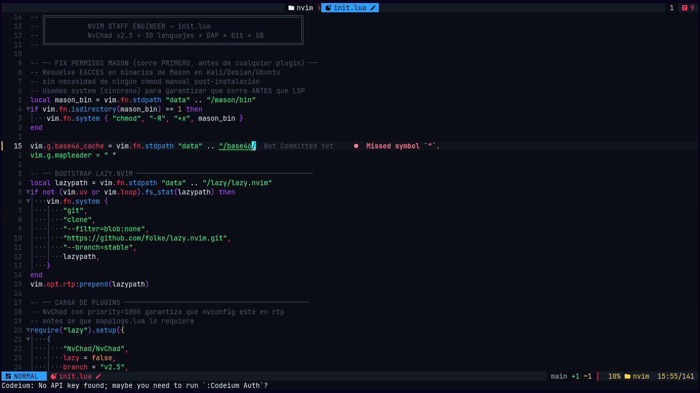
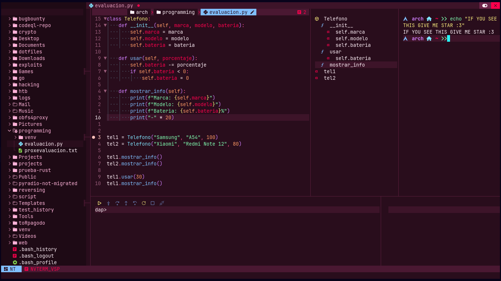

<div align="center">

# 🌙 nvim-config

### Your trusted femboy brings you a perfect Neovim configuration.

_You know, the usual stuff._




</div>

---

## ⚠️ Disclaimer: this config is ACTUALLY ONLY FOR ARCH LINUX

Yes, really. The bootstrap script talks to `pacman`, and I am not sorry.
Ubuntu, Fedora, macOS and Windows users are welcome to read the Lua and steal ideas, which is the whole point of open source.
Support for other distros is on the roadmap. _"Works on my machine" is a certified feature of this repo._

---

## ✨ Why this config exists

Most Neovim configs are either a 3-line `init.lua` or a 40-plugin Jenga tower that loads in two seconds.
This one aims for the middle: **a real IDE that starts fast and does not get in your way.**

- **Lazy by default.** Everything loads on an event, command or filetype, and nothing else. `defaults = { lazy = true }` is not decoration.
- **Reproducible.** `lazy-lock.json` pins every plugin, and `bootstrap.sh` installs system packages, plugins, parsers and every Mason tool in one go.
- **Theme-aware.** Rainbow delimiters, completion colors and the cursorline all follow whatever NvChad theme you pick. No hardcoded colors fighting your palette.
- **Opinionated, but justified.** One tool per job. If two plugins did the same thing, one of them got evicted (RIP `neogit` and `nvim-spectre`).

---

## 🖼️ Themes

Swapping themes recolors _everything_, including the rainbow brackets and the completion menu.

<table>
  <tr>
    <td></td>
    <td></td>
  </tr>
  <tr>
    <td></td>
    <td></td>
  </tr>
</table>

---

## 🐛 Debugging

A full DAP setup with a UI, virtual text and the standard IDE keys (`F5`, `F9`, `F10`, `F11`...). Because `print("here")` is not a debugger.



---

## 🚀 Installation (Arch Linux)

```bash
# 1. Minimal prerequisite
sudo pacman -Syu --needed git

# 2. Back up any existing config, then clone
mv ~/.config/nvim ~/.config/nvim.bak 2>/dev/null
git clone https://github.com/grubberdubber/nvim-config ~/.config/nvim

# 3. Run the bootstrap
~/.config/nvim/bootstrap.sh          # core toolchain
~/.config/nvim/bootstrap.sh --full   # + Java, PHP, .NET, LaTeX, Zathura
```

The first run takes **10 to 20 minutes** (Mason and Tree-sitter parsers compile a lot). Go make coffee. Or tea. I will not judge.

**What the bootstrap does**

1. Runs `pacman -Syu` first. Partial upgrades on Arch are how you meet a broken `node` at 2 AM.
2. Installs the system dependencies (`ripgrep`, `fd`, `nodejs`, `tree-sitter-cli`, a Nerd Font, ...).
3. Restores exact plugin versions from `lazy-lock.json`.
4. Builds the Tree-sitter parsers and compiles `avante.nvim`.
5. Installs every LSP, formatter, linter and debugger through Mason.
6. Verifies the result and tells you honestly what is missing.

> **Heads up:** the script has not been battle-tested on a pristine install yet. It reports failures and keeps going instead of exploding. If something breaks, please [open an issue](../../issues).

Do not forget to set your terminal font to a **Nerd Font**, or the icons will look like tofu.

---

## 🧰 What's inside

### Core

| Area       | Tools                                                                                    |
| ---------- | ---------------------------------------------------------------------------------------- |
| Base       | [NvChad](https://github.com/NvChad/NvChad) v2.5, `lazy.nvim`, `which-key.nvim`           |
| Completion | `blink.cmp` with LSP, path, snippets, buffer and Dadbod sources                          |
| AI         | `avante.nvim` with automatic model fallback when your quota runs out, plus `codeium.vim` |
| Syntax     | `nvim-treesitter` + textobjects, `rainbow-delimiters.nvim`, `nvim-ufo` folds             |
| Formatting | `conform.nvim` (format on save, LSP fallback)                                            |
| Linting    | `nvim-lint` (`sqlfluff` with dialect picker, `stylelint`, `markdownlint-cli2`)           |
| Tooling    | `mason.nvim` + `mason-lspconfig`, `schemastore.nvim`                                     |

### Navigation and editing

| Area           | Tools                                                                              |
| -------------- | ---------------------------------------------------------------------------------- |
| Files          | `nvim-tree`, `oil.nvim`, `harpoon`, `telescope` + `fzf-native`                     |
| Code map       | `aerial.nvim`, `trouble.nvim`, `todo-comments.nvim`                                |
| Editing        | `nvim-surround`, `nvim-autopairs`, `nvim-ts-autotag`, `multicursor.nvim`, `treesj` |
| Search/replace | `grug-far.nvim`                                                                    |
| Refactor       | `refactoring.nvim`                                                                 |
| Git            | `gitsigns.nvim`, `diffview.nvim`, `lazygit.nvim`                                   |
| Sessions       | `persistence.nvim`                                                                 |

### Special features

- 🌈 **Rainbow brackets inside the completion docs.** Blink paints its documentation window with its own extmarks, so `rainbow-delimiters` never reached it. A small patch in `autocmds.lua` colors them with the same theme-linked groups, in every language that has a rainbow query. Yes, I went there.
- 🧠 **Gemini quota cascade.** When Avante hits a rate limit, it steps down to the next model on its own. No more rage-quitting mid-refactor.
- 🧱 **Smart HTML Enter and Backspace.** VS Code-style splitting between `<tag>` and `</tag>`, with column-aware backspace.
- 🗄️ **SQL that knows your dialect.** `vim-dadbod`, `sqls.nvim` and a dialect picker for MySQL, PostgreSQL and friends.
- 🧪 **Run code in place.** `iron.nvim` for REPLs and `sniprun` for quick snippets.
- 🚪 **`q` closes the junk.** NvimTree, Aerial, Avante, Diffview, Trouble, Telescope, help and quickfix all close with a single `q`.

### Markdown (yes, it gets its own section)

Because nobody should have to push to GitHub just to see how a README looks.

- `render-markdown.nvim` renders headings, tables, checkboxes and code blocks inside the buffer.
- `markdown-preview.nvim` opens a GitHub-style live preview in your browser, with Mermaid and KaTeX.
- `marksman` LSP, `prettier` formatting and `markdownlint-cli2` linting.

---

## 🌍 Languages

LSP, formatting and debugging are set up for the following (some need their toolchain, which `--full` installs):

| Category            | Languages                                                |
| ------------------- | -------------------------------------------------------- |
| Web / Frontend      | HTML, CSS, JavaScript, TypeScript, PHP, Emmet            |
| Systems / Low level | C, C++, Rust, Go, C#, Java, Assembly                     |
| Scripting           | Python, Bash, PowerShell, Ruby                           |
| Mobile              | Kotlin, Swift, Dart                                      |
| Data                | SQL (MySQL, PostgreSQL, SQLite, MSSQL), JSON, YAML, TOML |
| Docs                | Markdown, LaTeX (`vimtex` + `texlab`)                    |
| Other               | Lua, Nim, Scala                                          |

Some servers in the list (`dartls`, `julials`, `metals`, `perlnavigator`) are not in Mason and need their own SDK. Neovim simply ignores them until you install them.

---

## ⌨️ Key bindings

`<leader>` is `Space`. Press it and wait: `which-key` shows the rest.

### Everyday

| Key                    | Action                                                       |
| ---------------------- | ------------------------------------------------------------ |
| `-`                    | Oil: open the parent directory as a buffer                   |
| `<leader>ha` / `<C-e>` | Harpoon: add file / open menu                                |
| `<leader>1` ... `4`    | Harpoon: jump to file 1 to 4                                 |
| `<leader>gg`           | Lazygit                                                      |
| `<leader>S`            | grug-far: search and replace in the project                  |
| `<leader>sw`           | grug-far: replace the word under the cursor                  |
| `<leader>J`            | treesj: split or join the block under the cursor             |
| `<leader>cp`           | Color picker (ccc)                                           |
| `q`                    | Close auxiliary windows (tree, aerial, avante, trouble, ...) |

### Markdown

| Key          | Action                     |
| ------------ | -------------------------- |
| `<leader>mr` | Toggle in-buffer rendering |
| `<leader>mp` | Toggle browser preview     |

### LSP

| Key          | Action              |
| ------------ | ------------------- |
| `gd`         | Go to definition    |
| `K`          | Hover documentation |
| `<leader>ca` | Code actions        |
| `<leader>rn` | Rename symbol       |

### Debugger

| Key                   | Action                 |
| --------------------- | ---------------------- |
| `F5`                  | Start / continue       |
| `F9`                  | Toggle breakpoint      |
| `F10` / `F11` / `F12` | Step over / into / out |
| `Shift+F5`            | Stop                   |
| `<leader>B`           | Conditional breakpoint |
| `<leader>du`          | Toggle debugger UI     |

### Extras

| Key          | Action                         |
| ------------ | ------------------------------ |
| `<leader>sr` | Sniprun: run line or selection |
| `<leader>ro` | Iron: open a REPL              |
| `<leader>db` | Dadbod UI                      |
| `<C-g>`      | Codeium: accept suggestion     |

---

## 🗂️ Structure

```text
~/.config/nvim
├── init.lua                  # lazy.nvim bootstrap + options
├── bootstrap.sh              # one-command setup for Arch
├── lazy-lock.json            # pinned plugin versions
├── markdownlint-cli2.yaml    # linked to ~/.markdownlint-cli2.yaml
├── after/ftplugin/           # per-filetype settings (markdown, ...)
├── assets/                   # screenshots used in this README
└── lua/
    ├── chadrc.lua            # NvChad theme + highlight overrides
    ├── mappings.lua
    ├── options.lua
    ├── autocmds.lua
    ├── configs/              # blink, conform, lint, lspconfig, dap, ...
    └── plugins/              # init.lua, extras.lua, markdown.lua
```

---

## 🧯 Troubleshooting

| Symptom                                      | Fix                                                                    |
| -------------------------------------------- | ---------------------------------------------------------------------- |
| Icons look like boxes                        | Set your terminal font to a Nerd Font                                  |
| `node: error while loading shared libraries` | You did a partial upgrade. Run `sudo pacman -Syu`                      |
| Avante errors on startup                     | `:Lazy build avante.nvim` (needs `cargo`)                              |
| Markdown preview does not open               | `cd ~/.local/share/nvim/lazy/markdown-preview.nvim/app && npm install` |
| `:DiffviewOpen` says "Not a repo"            | It only works inside a git repository, as one would hope               |

Run `:checkhealth` and `:Lazy` first. They know things.

---

## 🛣️ Roadmap

- [ ] Verify the bootstrap on a clean Arch install
- [ ] Support for other distributions (after the Arch one is boringly stable)
- [ ] Neovim `-V1` startup time benchmarks in this README

---

## 🤝 Contributing

Issues and PRs are welcome, as long as they keep the philosophy: **justified plugins, fast startup, no bloat.**
If your PR adds a plugin, explain which problem it solves that the current setup does not.

---

## 📜 License

GPL-3.0. Free as in freedom, free as in "please do not ask me to fix your `init.lua` on a Friday."

<div align="center">

_I use Arch, btw._ 🐧

</div>
